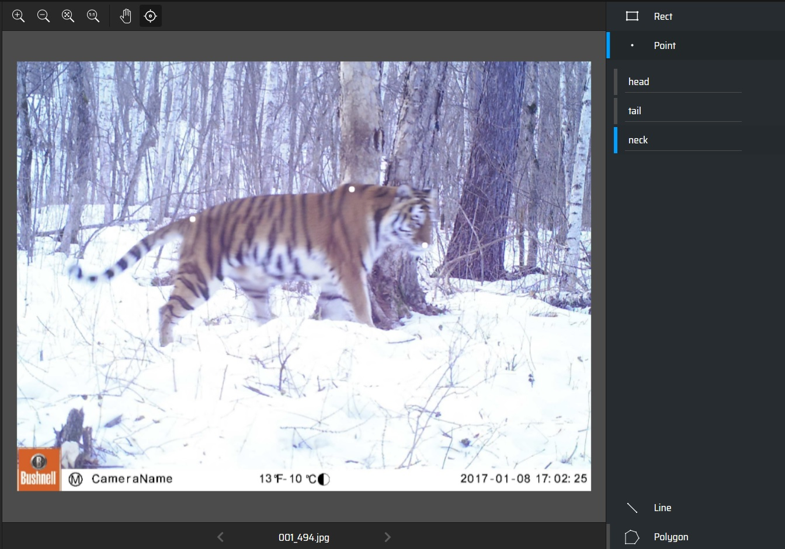
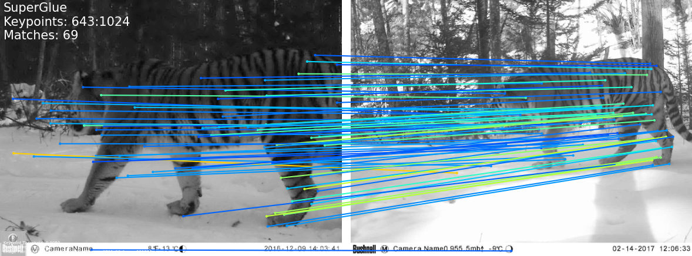
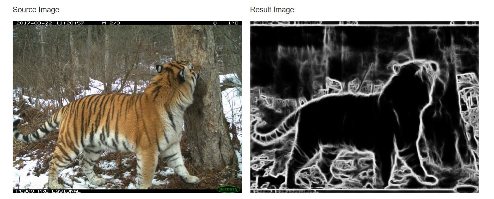

# RedListHack

Решение "Команды А" для Самарского хакатона по икусственному интеллекту 2021.

## Оглавление

1. [Описание кейса]()

2. [Техническое решение]()

    2.1. [Детектирование и классификация]()

    2.2. [Распознавание уникальной особи]()

3. [Развертывание и запуск]()

4. [Дальнейшее развитие проекта]()

## Описание кейса

Наш решение предназначено для детектирования и классификации амурских тигров и дальневосточных леопардов - видов, занесенных в красных книгу, - и распознавании уникальной особи амурского тигра, тигрицы Принцессы. Датасет для обучения моделей предоставлен организаторами [хакатона](https://hacks-ai.ru/hakaton/samara).

## Техническое решение

## Детектирование и классификация

Для обучения моделей классификации и детектирования мы использовали фреймворк [Detectron2](https://github.com/facebookresearch/detectron2). Мы использовали архитектуру [Fast R-CNN](https://arxiv.org/abs/1504.08083).

В начале мы обучаем детектор только на изображениях тигров и леопардов в течении 1 эпохи. Затем использовали полученную модель с низким порогом реагирования для отрисовки bounding box-ов на неразмеченных изображениях других видов животных, таким образом, получая рамки для неразмеченных данных (при этом количество ложно-позитивных срабатываний - срабатываний на изображениях, где вообще нет животных - было малым и отлавливалось руками).

После идет обучение классификатора и детектора на 3 классах: тигры, леопарды, другие виды животных.

Также в пайплайн решения входит дообучение модели в процессе эксплуатации: с камер поступают новые изображения - распознаваемые с высоким порогом уверенности сразу используются для дообучения, с низким - проверяются пользователем, затем поступают в систему.

## Распознавание уникальной особи

Для распознавания уникальной особи амурского тигра было опробовано несколько подходов:

1. Pose Estimation и обнаружение правого и левого полубоков.

2. Использование алгоритма [SIFT](https://ru.wikipedia.org/wiki/%D0%9C%D0%B0%D1%81%D1%88%D1%82%D0%B0%D0%B1%D0%BD%D0%BE-%D0%B8%D0%BD%D0%B2%D0%B0%D1%80%D0%B8%D0%B0%D0%BD%D1%82%D0%BD%D0%B0%D1%8F_%D1%82%D1%80%D0%B0%D0%BD%D1%81%D1%84%D0%BE%D1%80%D0%BC%D0%B0%D1%86%D0%B8%D1%8F_%D0%BF%D1%80%D0%B8%D0%B7%D0%BD%D0%B0%D0%BA%D0%BE%D0%B2).

3. Edge Detection и различные фильтры, накладываемые на изображения.

В итоге для распознавания Принцессы используются модель EfficientNetB0 для бинарной классификации - вначале происходит определение вида животного с помощью модели детекции, описанной выше, затем определяется является ли тигр Принцессой или нет. 

При дальнейшем развитии проекта планируется улучшение имеющихся моделей, а также проверка возможности объедиенения с подходами, описанными выше. Подобную реализацию мы нашли в [статье](https://openaccess.thecvf.com/content_ICCVW_2019/papers/CVWC/Shukla_A_Hybrid_Approach_to_Tiger_Re-Identification_ICCVW_2019_paper.pdf).

## Развертывание и запуск
